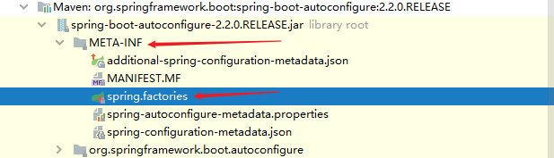

## SpringBoot 自动装配原理

* 位于项目下的pom.xml文件中有：

  ```xml
  <!-- 该项目有一个父项目，叫做spring-boot-starter-parent -->
  <parent>
      <groupId>org.springframework.boot</groupId>
      <artifactId>spring-boot-starter-parent</artifactId>
      <version>2.2.5.RELEASE</version>
      <relativePath/> <!-- lookup parent from repository -->
  </parent>
  ```

  ---

  点入spring-boot-starter-parent进入文件：spring-boot-starter-parent-2.2.5.RELEASE.pom，这个文件中有：

  ```xml
  <parent>
      <groupId>org.springframework.boot</groupId>
      <artifactId>spring-boot-dependencies</artifactId>
      <version>2.2.5.RELEASE</version>
      <relativePath>../../spring-boot-dependencies</relativePath>
  </parent>
  ```

  ---

  点入spring-boot-dependencies进入文件：spring-boot-dependencies-2.2.5.RELEASE.pom，这个文件中管理了大量的jar包版本（核心依赖）。

---

* 位于项目下的pom.xml文件中有：

  ```xml
  <!-- 启动器 -->
  <dependency>
      <groupId>org.springframework.boot</groupId>
      <artifactId>spring-boot-starter</artifactId>
  </dependency>
  ```

  * 启动器：就是springboot的启动场景

  * 比如spring-boot-starter-web，springboot就会帮我们自动导入web环境所有的依赖。

  * Springboot会将所有的功能场景，都变成一个个的启动器

    https://docs.spring.io/spring-boot/docs/2.2.5.RELEASE/reference/html/using-spring-boot.html#using-boot-starter

---

* 主程序

  ```java
  // @SpringBootApplication : 标注这个类是一个SpringBoot的应用：启动类下的所有资源被导入
  @SpringBootApplication
  public class Springboot02HelloworldApplication {
  
      public static void main(String[] args) {
          // run方法通过反射将SpringBoot启动
          SpringApplication.run(Springboot02HelloworldApplication.class, args);
      }
  
  }
  ```

  * 首先看注解：@SpringBootApplication

    ```java
    @Target(ElementType.TYPE)
    @Retention(RetentionPolicy.RUNTIME)
    @Documented
    @Inherited
    @SpringBootConfiguration
    @EnableAutoConfiguration
    @ComponentScan(excludeFilters = { @Filter(type = FilterType.CUSTOM, classes = TypeExcludeFilter.class),
    		@Filter(type = FilterType.CUSTOM, classes = AutoConfigurationExcludeFilter.class) })
    public @interface SpringBootApplication {
    
    	@AliasFor(annotation = EnableAutoConfiguration.class)
    	Class<?>[] exclude() default {};
    
    	@AliasFor(annotation = EnableAutoConfiguration.class)
    	String[] excludeName() default {};
    
    	@AliasFor(annotation = ComponentScan.class, attribute = "basePackages")
    	String[] scanBasePackages() default {};
    
    	@AliasFor(annotation = ComponentScan.class, attribute = "basePackageClasses")
    	Class<?>[] scanBasePackageClasses() default {};
    
    	@AliasFor(annotation = Configuration.class)
    	boolean proxyBeanMethods() default true;
    
    }
    ```

    * SpringBootConfiguration

      ```java
      @Target(ElementType.TYPE)
      @Retention(RetentionPolicy.RUNTIME)
      @Documented
      @Configuration
      public @interface SpringBootConfiguration {
      
      	@AliasFor(annotation = Configuration.class)
      	boolean proxyBeanMethods() default true;
      
      }
      ```

      ```java
      @Target(ElementType.TYPE)
      @Retention(RetentionPolicy.RUNTIME)
      @Documented
      @Component
      public @interface Configuration {
          
      	@AliasFor(annotation = Component.class)
      	String value() default "";
      
      	boolean proxyBeanMethods() default true;
      
      }
      ```

    * EnableAutoConfiguration

      ```java
      @Target(ElementType.TYPE)
      @Retention(RetentionPolicy.RUNTIME)
      @Documented
      @Inherited
      @AutoConfigurationPackage
      @Import(AutoConfigurationImportSelector.class)
      public @interface EnableAutoConfiguration {
      
      	String ENABLED_OVERRIDE_PROPERTY = "spring.boot.enableautoconfiguration";
      
      	String[] excludeName() default {};
      
      }
      ```

      ```java
      @Target(ElementType.TYPE)
      @Retention(RetentionPolicy.RUNTIME)
      @Documented
      @Inherited
      @Import(AutoConfigurationPackages.Registrar.class)
      public @interface AutoConfigurationPackage {
      
      }
      ```

    ---

    ```
    @SpringBootApplication
    	@SpringBootConfiguration : SpringBoot的配置
    		@Configuration : spring配置类
    			@Component : 说明这是一个spring组件
    	
    	@EnableAutoConfiguration : 自动配置
    		@AutoConfigurationPackage : 导入配置包
    			@Import(AutoConfigurationPackages.Registrar.class)  :自动配置，包注册
    		@Import(AutoConfigurationImportSelector.class) : 自动配置导入选择
    ```
    
    AutoConfigurationImportSelector类中有一个名为getAutoConfigurationEntry的函数：
    
    ```java
    protected AutoConfigurationEntry getAutoConfigurationEntry(AutoConfigurationMetadata autoConfigurationMetadata,
                                                               AnnotationMetadata annotationMetadata) {
        if (!isEnabled(annotationMetadata)) {
            return EMPTY_ENTRY;
        }
        AnnotationAttributes attributes = getAttributes(annotationMetadata);
        // 获取所有的配置
        List<String> configurations = getCandidateConfigurations(annotationMetadata, attributes);
    
        configurations = removeDuplicates(configurations);
        Set<String> exclusions = getExclusions(annotationMetadata, attributes);
        checkExcludedClasses(configurations, exclusions);
        configurations.removeAll(exclusions);
        configurations = filter(configurations, autoConfigurationMetadata);
        fireAutoConfigurationImportEvents(configurations, exclusions);
        return new AutoConfigurationEntry(configurations, exclusions);
    }
    ```
    
    点进 getCandidateConfigurations（也是在AutoConfigurationImportSelector类中）：
    
    ```java
    // 获取候选的配置：核心方法
    protected List<String> getCandidateConfigurations(AnnotationMetadata metadata, AnnotationAttributes attributes) {
        // SpringFactoriesLoader
        List<String> configurations = SpringFactoriesLoader.loadFactoryNames(getSpringFactoriesLoaderFactoryClass(),
                                                                             getBeanClassLoader());
        // META-INF/spring.factories ： 自动配置的核心文件
        Assert.notEmpty(configurations, "No auto configuration classes found in META-INF/spring.factories. If you "
                        + "are using a custom packaging, make sure that file is correct.");
        return configurations;
    }
    
    protected Class<?> getSpringFactoriesLoaderFactoryClass() {
        return EnableAutoConfiguration.class;
    }
    ```
    
    
    
    spring.factories存放着所有的自动配置类（但是没有全部生效）：
    
    ```properties
    # Initializers
    org.springframework.context.ApplicationContextInitializer=\
    org.springframework.boot.autoconfigure.SharedMetadataReaderFactoryContextInitializer,\
    org.springframework.boot.autoconfigure.logging.ConditionEvaluationReportLoggingListener
    
    # Application Listeners
    org.springframework.context.ApplicationListener=\
    org.springframework.boot.autoconfigure.BackgroundPreinitializer
    
    # Auto Configuration Import Listeners
    org.springframework.boot.autoconfigure.AutoConfigurationImportListener=\
    org.springframework.boot.autoconfigure.condition.ConditionEvaluationReportAutoConfigurationImportListener
    
    # Auto Configuration Import Filters
    org.springframework.boot.autoconfigure.AutoConfigurationImportFilter=\
    org.springframework.boot.autoconfigure.condition.OnBeanCondition,\
    org.springframework.boot.autoconfigure.condition.OnClassCondition,\
    org.springframework.boot.autoconfigure.condition.OnWebApplicationCondition
    
    # Auto Configure
    org.springframework.boot.autoconfigure.EnableAutoConfiguration=\
    org.springframework.boot.autoconfigure.admin.SpringApplicationAdminJmxAutoConfiguration,\
    ...
    
    
    # Failure analyzers
    org.springframework.boot.diagnostics.FailureAnalyzer=\
    org.springframework.boot.autoconfigure.diagnostics.analyzer.NoSuchBeanDefinitionFailureAnalyzer,\
    ...
    
    # Template availability providers
    org.springframework.boot.autoconfigure.template.TemplateAvailabilityProvider=\
    org.springframework.boot.autoconfigure.freemarker.FreeMarkerTemplateAvailabilityProvider,\
    ...
    
    ```
    
     点进 SpringFactoriesLoader类，其中存在方法loadSpringFactories：
    
    ```java
    public static final String FACTORIES_RESOURCE_LOCATION = "META-INF/spring.factories";
    
    private static Map<String, List<String>> loadSpringFactories(@Nullable ClassLoader classLoader) {
        MultiValueMap<String, String> result = cache.get(classLoader);
        if (result != null) {
            return result;
        }
    
        try {
            // FACTORIES_RESOURCE_LOCATION：META-INF/spring.factories
            Enumeration<URL> urls = (classLoader != null ? classLoader.getResources(FACTORIES_RESOURCE_LOCATION) :
    ClassLoader.getSystemResources(FACTORIES_RESOURCE_LOCATION));
            result = new LinkedMultiValueMap<>();
            while (urls.hasMoreElements()) {
                URL url = urls.nextElement();
                UrlResource resource = new UrlResource(url);
                // 所有的资源加载到配置类中
                Properties properties = PropertiesLoaderUtils.loadProperties(resource);
                for (Map.Entry<?, ?> entry : properties.entrySet()) {
                    String factoryTypeName = ((String) entry.getKey()).trim();
                    for (String factoryImplementationName : StringUtils.commaDelimitedListToStringArray((String) entry.getValue())) {
                        result.add(factoryTypeName, factoryImplementationName.trim());
                    }
                }
            }
            cache.put(classLoader, result);
            return result;
        }
        catch (IOException ex) {
            throw new IllegalArgumentException("Unable to load factories from location [" +
                                               FACTORIES_RESOURCE_LOCATION + "]", ex);
        }
    }
    ```

  结论：SpringBoot所有自动配置都是在启动的时候扫描并被加载的，所有的自动配置类都在spring.factories文件中，但是不一定生效，要判断条件是否成立。只要导入了对应的starter，就有对应的启动器了，有了启动器，我们自动装配就会生效，然后就配置成功!

  1. SpringBoot在启动的时候，从类路径下/META-INF/spring.factories获取指定的值；
  2. 将这些自动配置的类导入容器，自动配置类就会生效，帮我们自动配置；
  3. 我们以前需要自动配置的东西，现在springboot帮我们做了；
  4. 整个JavaEE，解决方案和自动配置的东西都在spring-boot-autoconfigure-2.2.0.RELEASE.jar 这个包下；
  5. 它会把所有需要导入的组件，以类名的形式返回，这些组件就会被添加到容器中；
  6. 容器中也会存在很多的xxxAutoConfiguration的文件(@Bean)，就是这些类给容器中导入了这个场景所需要的所有组件；并自动配置（@Configuration）
  7. 有了自动配置类，免去了我们手动编写配置文件的工作！

  ---

  * SpringApplication.run()

    这句代码开启了一个服务，分析该方法分为两部分，一部分是SpringApplication实例，另一部分是run方法

    SpringApplication：这个类主要做了四件事情：

    1. 推断应用的类型是普通的项目还是Web项目
    2. 查找并加载所有可用初始化器，设置到initializers属性中
    3. 找出所有的应用程序监听器，设置到listeners属性中
    4. 推断并设置main方法的定义类，找到运行的主类


