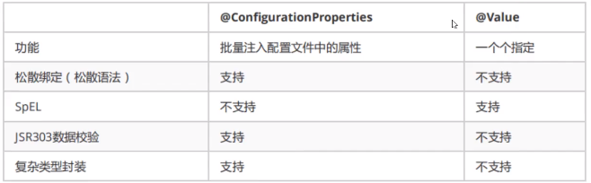
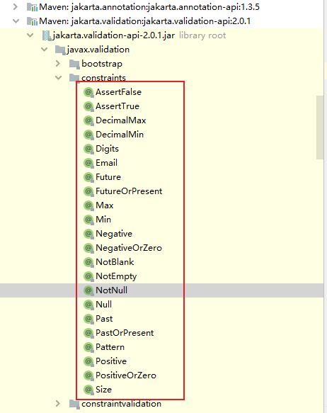
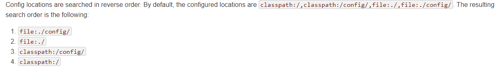
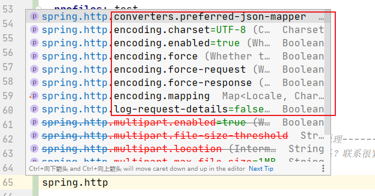
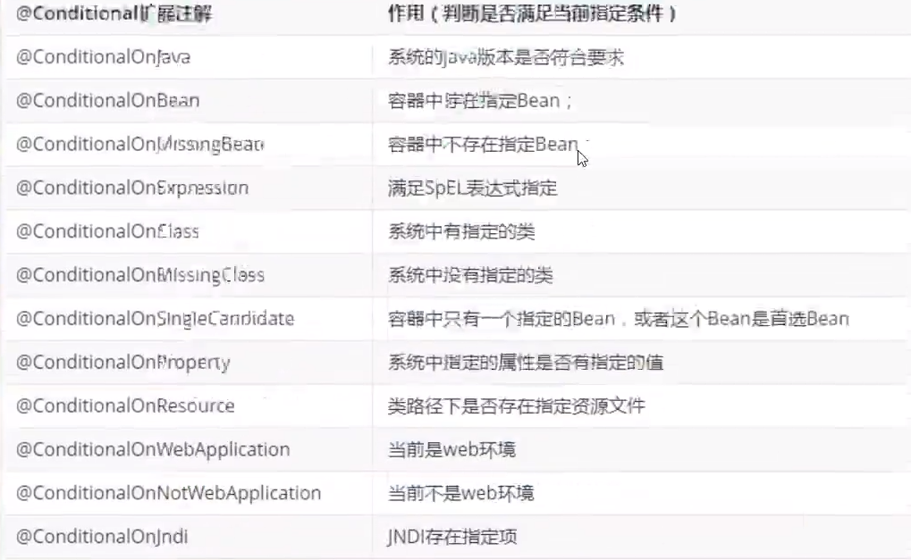

## SpringBoot配置文件及自动配置原理

### 配置文件

SpringBoot使用一个全局配置文件，配置文件名称是固定的

* application.properties
  * 语法结构：key=value
* application.yaml
  * 语法结构：key: 空格 value

**配置文件的作用：**修改SpringBoot自动配置的默认值，因为SpringBoot在底层给我们自动配置好了。


### YAML

YAML是"YAML Ain't Markup Language"（YAML不是一红标志语言）的递归缩写。

在开发这种语言时，YAML的意思其实是："Yet Another Markup Language"（仍是一种标志语言）

YAML A Markup Language : 是一个标记语言

YAML isnot Markup Language : 不是一个标记语言

**标记语言**

以前的配置文件，大多数都是使用xml来配置；比如一个简单的端口设置，我们来对比下yaml和xml

yaml配置：

```yaml
server:
  port: 8080
```

xml配置：

```xml
<server>
	<port>8080</port>
</server>
```


### YAML语法

参照：application.yaml

```yaml
# springboot这个配置文件中到底可以配置哪些东西呢？
# 官方的配置太多了，我们了解原理之后，可以一通百通
# 官网配置网址：https://docs.spring.io/spring-boot/docs/2.1.6.RELEASE/reference/htmlsingle/#boot-features-external-config

server:
  port: 8080

# 普通的key-value键值对
name: wxx


# 对象
student:
  name: wxx
  age: 3

student2: {name: wxx,age: 3}


# 数组
pets:
  - cat
  - dog
  - pig

pets2: [cat,dog,pig]
```

**yaml的强大之处在于可以给实体类赋值**

```java
/*
 * @ConfigurationProperties 作用：
 * 将配置文件中配置的每一个属性的值，映射到这个组件中
 * 告诉SpringBoot将本类中的所有属性和配置文件中相关的配置进行绑定
 * 参数 prefix = "person" : 将配置文件中的person下面的属性一一对应
 *
 * 只有这个组件(这里是指Person)是容器中的组件，才能使用容器提供的@ConfigurationProperties功能
 */

/*
 * 也可以不适用yaml注入，可以使用properties注入值
 * @PropertySource(value = "classpath:wxx.properties")
 * 前提要在resources文件中新建wxx.properties这个文件
 *
 * 之后在属性上标注：@Value("$(name)")  取出 wxx.properties 中的name属性给属性赋值
 * $(name)：SPEL表达式
 * 
 * 这种方式不推荐使用，因为需要给每个属性单独注解赋值，比较麻烦
 */
```

两种方式的对比：



* ConfigurationProperties只需要写一次即可，Value则需要每个字段都添加
* 松散绑定：这个是什么意思呢？比如我们的yaml文件中写的是last-name，这个和lastName是一样的，- 后面的字母默认是大写的。这就是松散绑定
* JSR303数据校验，这个就是我们可以在字段上增加一层过滤器验证，可以保证数据的合法性
* 复杂数据封装：yaml中可以封装对象，使用@Value就不支持

**结论**

* 如果yaml和配置properties都可以取到值，强烈推荐yaml
* 如果我们在某个业务中，只需要获取配置文件的某个值，可以使用一下@Value
* 如果说，我们专门编写一个JavaBean来和配置文件进行映射，就直接使用@ConfigurationProperties，不要犹豫！


### JSR303数据校验

SpringBoot中可以使用@validated来校验数据，如果数据异常则会统一抛出异常，方便异常中心统一处理

```java
@NotNull(message = "名字不能为空")
private String userName;
@Max(value = 120, message = "年龄不能超过120岁")
private int age;
@Email(message = "邮箱格式错误")
private String email;

// 空检查
@Null 			// 验证对象是否为空
@NotNull		// 验证对象是否不为空，无法检查长度为0的字符串
@NotBlank		// 检查约束字符串是不是null，还有被trim后的长度是否大于0，只对字符串，且会去掉前后空格
@NotEmpty		// 检查约束元素是否为null或者empty

// Boolean检查
@AssertTrue		// 验证 Boolean 对象是否为 true
@AssertFalse	// 验证 Boolean 对象是否为 false

// 长度检查
@Size(min=, max=)	// 验证对象(Array, Collection, Map, String)长度是否在指定范围内
@Length(min=, max=) // valisates that the annotated string is between min and max included

// 日期检查
@Past			// 验证 Date 和 Calendar 对象是否在当前时间之前
@Future			// 验证 Date 和 Calendar 对象是否在当前时间之后


@Pattern		// 验证 String 对象是否符合正则表达式的规则

......
此外，我们还可以自定义一些数据校验规则
```

源码所在位置：




### 配置文件位置

网址：https://docs.spring.io/spring-boot/docs/2.1.6.RELEASE/reference/htmlsingle/#boot-features-external-config



file：代表当前项目文件夹

classpath：类路径，一般指java和resources文件夹

* 如果这四个位置都要配置文件，1的优先级最高，4的优先级最低


### 自动配置原理再理解

配置文件和spring.factories联系很紧密

以spring.factories中的org.springframework.boot.autoconfigure.web.servlet.HttpEncodingAutoConfiguration为例：

```java
// 表示这个一个配置类
@Configuration(proxyBeanMethods = false)

// 自动配置属性  HttpProperties
@EnableConfigurationProperties(HttpProperties.class)

// Spring的底层注解：根据不同的条件，来判断当前配置或者类是否生效！
@ConditionalOnWebApplication(type = ConditionalOnWebApplication.Type.SERVLET)
@ConditionalOnClass(CharacterEncodingFilter.class)
@ConditionalOnProperty(prefix = "spring.http.encoding", value = "enabled", matchIfMissing = true)
public class HttpEncodingAutoConfiguration {

	private final HttpProperties.Encoding properties;

	public HttpEncodingAutoConfiguration(HttpProperties properties) {
		this.properties = properties.getEncoding();
	}

	@Bean
	@ConditionalOnMissingBean
	public CharacterEncodingFilter characterEncodingFilter() {
		CharacterEncodingFilter filter = new OrderedCharacterEncodingFilter();
		filter.setEncoding(this.properties.getCharset().name());
		filter.setForceRequestEncoding(this.properties.shouldForce(Type.REQUEST));
		filter.setForceResponseEncoding(this.properties.shouldForce(Type.RESPONSE));
		return filter;
	}

	@Bean
	public LocaleCharsetMappingsCustomizer localeCharsetMappingsCustomizer() {
		return new LocaleCharsetMappingsCustomizer(this.properties);
	}

	private static class LocaleCharsetMappingsCustomizer
			implements WebServerFactoryCustomizer<ConfigurableServletWebServerFactory>, Ordered {

		private final HttpProperties.Encoding properties;

		LocaleCharsetMappingsCustomizer(HttpProperties.Encoding properties) {
			this.properties = properties;
		}

		@Override
		public void customize(ConfigurableServletWebServerFactory factory) {
			if (this.properties.getMapping() != null) {
				factory.setLocaleCharsetMappings(this.properties.getMapping());
			}
		}

		@Override
		public int getOrder() {
			return 0;
		}

	}
}
```

点进去HttpProperties：

```java
@ConfigurationProperties(prefix = "spring.http")
public class HttpProperties {

	private boolean logRequestDetails;

	private final Encoding encoding = new Encoding();

	public boolean isLogRequestDetails() {
		return this.logRequestDetails;
	}

	public void setLogRequestDetails(boolean logRequestDetails) {
		this.logRequestDetails = logRequestDetails;
	}

	public Encoding getEncoding() {
		return this.encoding;
	}

	public static class Encoding {

		public static final Charset DEFAULT_CHARSET = StandardCharsets.UTF_8;

		private Charset charset = DEFAULT_CHARSET;

		private Boolean force;

		private Boolean forceRequest;


		private Boolean forceResponse;

		private Map<Locale, Charset> mapping;

		public Charset getCharset() {
			return this.charset;
		}
        
        // ......

		public enum Type {
			REQUEST, RESPONSE
		}
	}
}
```



---

我们在application.yaml中可以配置的内容，都存在一个固有的规律

xxxAutoConfiguration：默认值     xxxProperties 和 配置文件（application.yaml）绑定，这样我们就可以自定义配置了

---

一旦一个配置类生效，这个配置类就会给容器中添加各种组件；这些组件的属性是从对应的properties类中获取的，这些类里面的每一个属性又是和配置文件（application.yaml）绑定的

**精髓：**

1. SpringBoot启动会加载大量的自动配置类
2. 我们看我们需要的功能有没有在SpringBoot默认写好的自动配置类中
3. 我们再来看这个自动配置类中到底配置了哪些组件；（只要我们的组件在其中，我们就不需要手动配置了）
4. 给容器中自动配置类添加组件的时候，会从properties类中获取属性。我们只需要在配置文件中指定这些属性的值即可。

xxxAutoConfiguration：自动配置类；给容器添加组件

xxxProperties ：封装配置文件中相关属性


### @Conditional

了解完自动配置的原理之后，我们来关注一个细节问题，**自动配置类必须在一定的条件下才能生效**

@Conditional派生注解（Spring注解版原生的@Conditional作用）

作用：必须是@Conditional条件成立，才能给容器添加组件，配置配里面的所有内容才能生效；



那么多的自动配置类，必须在一定条件下才能生效；也就是说，我们加载了这么多的配置类，但是不是所有的都生效的了。

我们怎么知道哪些自动配置类生效？我们可以通过启用debug: true属性；来让控制台自动打印自动配置报告，这样来就可以方便的知道哪些自动配置类生效

* Positive matches：自动配置类启用的，正匹配
* Negative matches：没有启动，没有匹配成功的自动配置类，负匹配
* Unconditional classes：没有条件的类